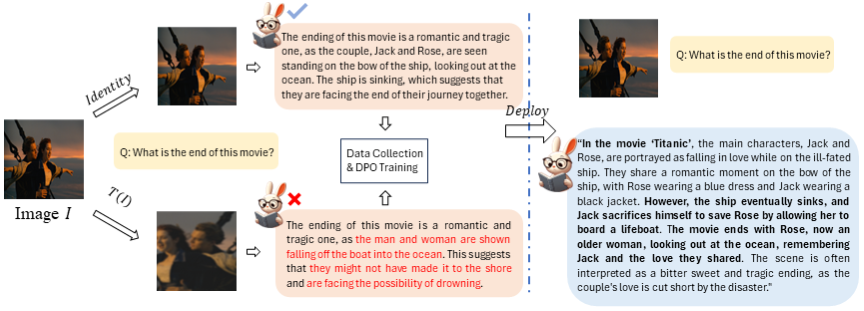

# :rabbit2:	Self-Supervised Visual Preference Alignment
We make the first attempt towards **unsupervised preference alignment** in Large Vision-Language Models.

*The whole pipeline do not need any GPT-4 or humman annotated labels in preference alignment*. [Paper](https://arxiv.org/abs/2404.10501)


 


## Contents
- [Install](#Install)
- [Dataset](#Data)
- [SeVa pipeline](data/README.md)
- [Model](#Model)
- [Training](#Training)
- [Evaluation](#Evaluation)


## Install
First, clone this repo and navigate to SeVa folder:
```
git clone https://github.com/Kevinz-code/SeVa.git
cd SeVa
```
Then create a conda environment and install packages
```
conda create -n seva python==3.9 -y
conda activate seva
pip install torch==2.0.1 torchvision==0.15.2
pip install -e .
```

## Dataset
We expect the **image dataset** to have the following structure:
```
data/
|-- texvqa/
|---- train_images/
......
|-- ocrvqa/
|---- images/
......
|-- coco2014/
|---- val2014/
```
In which *texvqa* and *ocrvqa* are used for DPO data generation, *coco2014* are optionally required for quick evalutation in POPE benchmark. You can download [textvqa](https://dl.fbaipublicfiles.com/textvqa/images/train_val_images.zip) and [coco2014](http://images.cocodataset.org/zips/val2014.zip) images in their official website. For ocrvqa images, download them using [ocrvqa scripts](https://drive.google.com/drive/folders/1_GYPY5UkUy7HIcR0zq3ZCFgeZN7BAfm_?usp=sharing) (following LLaVA).

## SeVa Pipeline
We have included a **detailed** data construction pipeline in `data/' folder, with *step1*, *step2* and *step3*. Refer to [README](data/README.md)
```
data/
|-- step1/
|-- step2/
|-- step3/
|-- README.md
```

## Model
Below are three SeVa models using 3 different DPO data source (Diffusion-steps500, Diffusion-steps800 and MOCO augmentaions). Standard deviation exists in some benchmarks (e.g., MM-Vet and LLaVA-Bench).
| Version | Augmentation | LLM | Schedule | Checkpoint | LLaVA-Bench | MM-Vet | MMB | MMB-CN | POPE| SEED | SHR (↓) | SQA | GQA |
|----------|------------|------|----------|------------|---|---|---|---|---|---|---|---|---|
| SeVa-7B | Diffusion500 | Vicuna-7B | lora_ft | [kevinke/seva-7b-diffu500](https://huggingface.co/kevinke/seva-7b-diffu500) | 70.7 | 35.5 | 64.7 | 58.8 | 86.8 | 65.8  | 32.7 | 67.4 | 61.1 |
| SeVa-7B | Diffusion800 | Vicuna-7B | lora_ft | [kevinke/seva-7b-diffu800](https://huggingface.co/kevinke/seva-7b-diffu800) | 72.2 | 37.2 | 65.6 | 59.2 | 86.7 | 65.8 | 34.9 | 67.5 | 60.7 |
| SeVa-7B | MOCO        | Vicuna-7B | lora_ft | [kevinke/seva-7b-moco](https://huggingface.co/kevinke/seva-7b-moco)      | 72.5 | 37.0 | 65.2 | 59.8 | 86.6 | 65.5 | 32.9 | 67.1 | 60.9| 


## Training
You need to first download weights of [LLaVA-v1.5-7b](https://huggingface.co/liuhaotian/llava-v1.5-7b). 

For running with DPO data sourced from Diffusion noise (*step=500*):
```
sh run/llava1.5_lora_our_ocr8k_diffu500_text8k_diffu500.sh
```

For running with DPO data sourced from Diffusion noise (*step=800*):
```
sh run/llava1.5_lora_our_ocr8k_diffu800_text8k_diffu800.sh
```


## Evaluation
Here we provide an evaluation on POPE benchmark, to help you get a quick evaluation of your models.

For models trained with diffusion steps500 DPO data, run
```
sh run/eval_pope_diffu500.sh
```
For models trained with diffusion steps800 DPO data, run
```
sh run/eval_pope_diffu800.sh
```

Refer to [LLaVa-1.5](https://github.com/haotian-liu/LLaVA/blob/main/docs/Evaluation.md) for a comprehension evaluation of multiple Benchmarks.

## Citation
If you find our paper or codebase useful, please consider cite
```
@misc{zhu2024selfsupervised,
    title={Self-Supervised Visual Preference Alignment},
    author={Ke Zhu and Liang Zhao and Zheng Ge and Xiangyu Zhang},
    year={2024},
    eprint={2404.10501},
    archivePrefix={arXiv},
    primaryClass={cs.CV}
}
```


## Acknowledgement
This repo is based on [HA-DPO](https://github.com/opendatalab/HA-DPO/) and [LLaVA](https://github.com/haotian-liu/LLaVA). We thank their efforts in building their codebase. 

